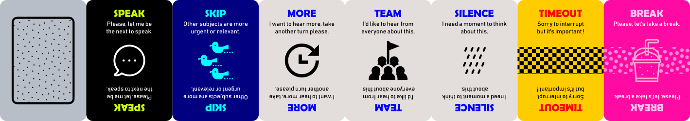

# A Moot Game
*Another take on making meetings productive and fun, the card game way.*

## Play session
Ready to rock a moot game with your team ?  
*A moot game is not a race, players will have time to speak and think.*

### The Facilitation
One or two Facilitators will have to :

* lead the game
* time the interventions
* ensure the rules are respected
* watch the goal
* watch the scores
* pin the actions on a board
* give the best advice to the team

 

#### Pre-requisites
* The subject to be discussed has already been decided.
* The moot game concept has been briefly introduced to the team by the session's facilitator.
* The duration of the game session has been decided with the help of the team accordingly to the subject's complexity.

#### Setting
* Gather your team around a table in a comfortable setting.
* Everybody leave their phones and computers away. *Coffees, teas, cookies and such are welcome though.*
* The maximum duration of a turn is voted by hand before the meeting starts. *Facilitator proposes 3, 5 or 7 minutes for example.*
* The game will only start when everybody is silent. *Team must remember that losing time can make it harder to win the game.*

### The Game
Breaking the following rules means buying beverages or sweets for the whole team.

* Only one person speaks at any given time.
* Every intervention is timed.
* Speaking can't last more than one timed turn.
* Speaking can last less than one timed turn.

#### Requirements
* One or two facilitator
* One pack of goal cards
* One timer *hourglass, chronometer, phone app*
* Paper and pen *or white board and felt*
* Sticky notes

##### For each player
* One pawn
* One pack of moot cards
* One pack of action cards
* One pack of vision cards

### Goal cards
These cards are meant to structure the game around a productive goal. 

Knowing the subject that the game must address, the Facilitator picks the most representative **goal card** which matches the subject's underlying goal. The card is placed at the center of the table, visible by everyone. A sticky note is placed by its side with the game subject written down on it. Each **goal card** defines its winning condition.

The Facilitator starts the game by exposing his/her understanding of the subject while ending the introduction by inviting people to expose their own understanding and start using a SPEAK card to do so.

#### Winning the game session
Each player places his/her pawn before them, and can *move it closer or further* to the goal card to express their appreciation on whether the winning condition is met.

If every pawn is placed on the goal card before the session ends, the team wins the game, or else the team loses. 

 

**Winning** should be taken as an indicator of a productive sessions and a team that can *achieve things*.
**Losing** should be taken as *a symptom of underlying issues*, which can be addressed through the next game session with an **UNDERSTAND** card goal.

### Action cards
These cards are meant to divide responsibilities among players by encouraging volunteering.

#### How do players handle actions ?
* They suggest actions at an y time by writing them down on sticky notes.
* The Facilitator sticks action into a "Parking Lot" board.
* The Facilitator can also suggest actions.
* They play an action card out of their hand, and go get the desired sticky note from the "Parking Lot" to their side of the table, near the action card they just played.
* A player without any more action card in hand cannot take further more under his/her responsibility.

### Vision cards
Any vision card can be put face up on the table to provide a feedback to the person speaking, at any moment, and put back in hand when the feedback is relevant no more.

**Builders** - These cards are meant to identify the bricks that will help win the game. 

At the end of a turn, the Facilitor brings into focus the possible keys to move a step forward when many builder cards have been played, and suggest the best way to bring further into light to these key points, ideas or actions.

**Breakers** - These cards are meant to identify the dangers that can make the team lose the game.

At the end of a turn, the Facilitor brings into focus the possible issues with an idea or subject when many breaker cards have been played, and suggest the best way to cope with it.

### Moot cards
These cards are meant to orchestrate discussions without unnecessary voicing and interruptions.

#### How do players handle moot ?
* They raise a **SPEAK** card to request a speaking turn.
* The person speaking can let somebody else speak, which ends the current turn, and starts another.
* First to raise, first to speak, unless you let your turn to somebody else.
* The Facilitator launches and stops the timer.
* They move closer or further away from the goal card, their pawn.
* They add or substract points to their jackpot (if you use scoring).

If no player wants to speak, the Facilitator may randomly chose somebody to do so.

## Scoring (optional)
Each player gains a score throughout the game which can be written on paper sheets, a white board table, or materialized by tokens (*beans, poker chips, cents...*)

At the end of the game, points will help players realize their degree of implication.  
During the game, points must be "paid" to break the flow by asking for a timeout or a break.

### Moot cards
* Playing a **SPEAK** makes the player win 1 point
* Playing a **BREAK** makes the player pays 5 points
* Playing a **TIMEOUT** makes the player pays 5 points

### Action cards
* Playing a **FIX** makes the player win 1 points
* Playing a **TODO** makes the player win 5 points
* Playing a **DO** makes the player win 10 points

### Vision cards
* Playing a *breaker card* makes the player win 5 points
* Playing a *builder card* makes the player win 5 points