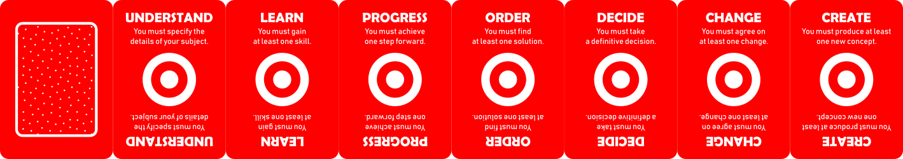
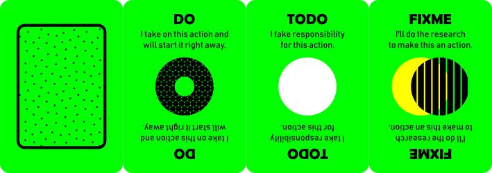
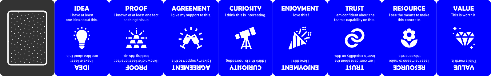
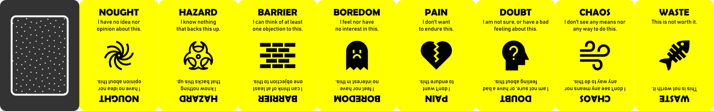
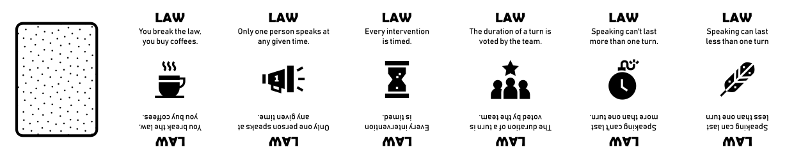

# A Moot Game
*Another take on making meetings productive and fun, the card game way.*

## Play session
Ready to rock a moot game with your team ?  
*A moot game is not a race, players will have time to speak and think.*

### The Facilitation
One or two Facilitators will have to :

* lead the game
* time the interventions
* ensure the rules are respected
* watch the scores
* watch the goal

#### Pre-requisites
* The subject to be discussed has already been decided.
* The moot game concept has been briefly introduced to the team by the session's facilitator.
* The duration of the game session has been decided with the help of the team accordingly to the subject's complexity.

#### Setting
* Gather your team around a table in a comfortable setting.
* Everybody leave their phones and computers away. *Coffees, teas, cookies and such are welcome though.*
* The duration of a turn is voted by hand before the meeting starts. *Facilitator proposes 3, 5 or 7 minutes for example.*
* The game will only start when everybody is silent. *Team must remember that losing time can make it harder to win the game.*

### The Cards
There are four types of cards, which are visually distinctive by color.

#### Goal cards
These cards are meant to structure the game around a productive goal. 

#### Action cards
These cards are meant to divide responsibilities among players by encouraging volunteering.

#### Vision cards
**Builders** - These cards are meant to identify the bricks that will help win the game. 

**Breakers** - These cards are meant to identify the hammers that can make the team lose the game.

#### Moot cards
These cards are meant to orchestrate discussions without unnecessary voicing and interruptions.

* **ME** - "I want to speak next" | *Raise that card if you want to speak.*
* **OKAY** - "I have no objections with what is being said" | *Raise that card to validate or support someone's saying.*
* **MORE** - "Give that person another turn" | *Raise that card when you request another turn for the person currently speaking.*
* **ROUND** - "I want to hear from everybody" | *Raise that card to request that everyone in the team tell their opinion one after another about the subject.*
* **TIMEOUT** - "Stop ! You need to hear me first" | *Raise that card when you request to interfere : you have an information that changes the situation, ends the subject, or the building is in fire.*
* **SKIP** - "We don't have time for this" | *Raise that card when you request skipping the current subject : it's irrelevant, counter-productive, or simply not a priority.*
* **BREAK** - "Let's take a break" | *Raise that card when you think it's time for a break. It has to last at the very least one turn.*
* **SILENCE** - "We should stop and think" | *Raise that card when you request a silent turn to think more efficiently for a bit.*

### The Game
Breaking the following rules means buying beverages or sweets for the whole team.

* Only one person speaks at any given time.
* Every intervention is timed.
* Speaking can't last more than one timed turn.
* Speaking can last less than one timed turn.

#### Requirements
* One or two facilitator
* One pack of goal cards
* One timer *hourglass, chronometer, phone app*
* Paper and pen *or white board and felt*
* Sticky notes

##### For each player
* One pawn
* One pack of moot cards
* One pack of action cards
* One pack of vision cards

#### Optional: scoring
Each player gains a score throughout the game which can be written on paper sheets, a white board table, or materialized by tokens (*beans, poker chips, cents...*)

**Moot cards**
* Playing a **ME** makes the player win a point
* Playing a **BREAK** makes the player lose a point
* Playing a **TIMEOUT** makes the player lose 2 points

**Action cards**
* Playing a **FIX** makes the player win 3 points
* Playing a **TODO** makes the player win 8 points
* Playing a **DO** makes the player win 10 points

**Vision cards**
* Playing a *breaker card* makes the player win 4 points
* Playing a *builder card* makes the player win 5 points

### 1. Starting with a goal

Knowing the subject that the game must address, the Facilitator picks the most representative **goal card** which matches the subject's underlying goal. The card is placed at the center of the table, visible by everyone. A sticky note is placed by its side with the game subject written down on it. Each **goal card** defines its winning condition.

The Facilitator starts the game by exposing his/her understanding of the subject while ending the introduction by inviting people to expose their own understanding and start using a ME card to do so.

#### How to win the game ?
Each player places his/her pawn before them, and can *move it closer or further* to the goal card to express their appreciation on whether the winning condition is met.

If every pawn is placed on the goal card before the session ends, the team wins the game, or else the team loses.  

**Winning** should be taken as an indicator of a productive sessions and a team that can *achieve things*.
**Losing** should be taken as *a symptom of underlying issues*, which can be addressed through the next game session with an **UNDERSTAND** card goal.

### 2. Speaking by turn

### 3. 